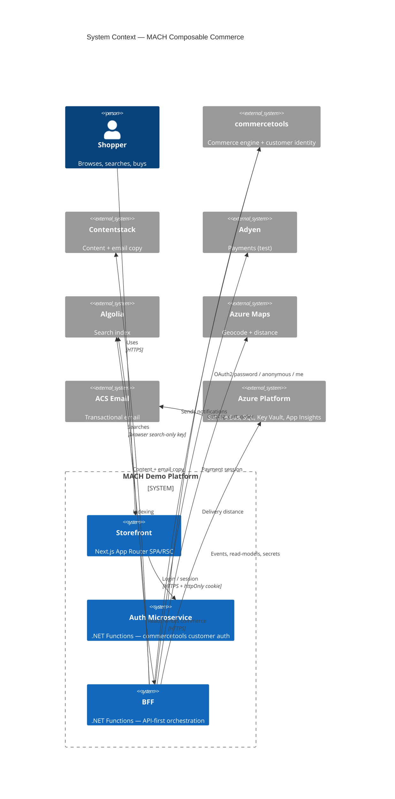
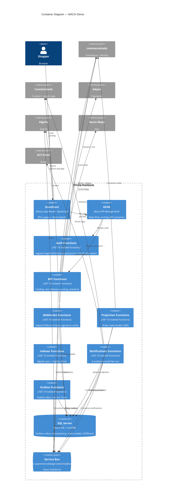

# MACH — Composable Commerce Demo

A greenfield, portfolio-grade **MACH** (Microservices, API-first, Cloud-native, Headless) composable-commerce platform: a polished Next.js storefront over a fleet of **.NET 10 Azure Functions** (isolated worker) — a dedicated **Auth microservice** and a **BFF** — orchestrating best-of-breed SaaS (commercetools, Contentstack, Adyen, Algolia, Azure Maps, ACS Email) on an Azure backbone (Service Bus, SQL, Key Vault, App Insights), provisioned with **Terraform** and shipped through **OIDC-secured CI/CD** with **OpenTelemetry** end-to-end tracing. It runs entirely locally — no Azure spend — while the infrastructure-as-code stands as production-ready target-topology documentation.

> This repository is an **architecture and platform-engineering showcase**. The emphasis is on clean hexagonal module boundaries, IaC/DevOps, and observability rather than feature breadth.

---

## MACH in this repository

| MACH pillar | How this repo embodies it |
|---|---|
| **M**icroservices | Independently deployable Azure Functions hosts — `Mach.Auth.Functions`, `Mach.Bff.Functions`, `Mach.Webhooks.Functions`, `Mach.Projection.Functions`, `Mach.Indexer.Functions`, `Mach.Notifications.Functions`, `Mach.Outbox.Functions` — each a separate unit of deployment and scale, communicating over HTTP and Azure Service Bus. |
| **A**PI-first | Every capability is exposed as a versioned HTTP contract behind APIM (`/api/...`); the storefront has **no** direct vendor coupling for commerce/identity — it talks only to the BFF and Auth APIs. Event contracts in `Mach.Contracts` are versioned records. |
| **C**loud-native | Stateless Functions on **Flex Consumption**, Service Bus topics for async/event-driven flows, transactional **outbox/inbox** for reliability, passwordless **managed-identity + Key Vault** secrets, OpenTelemetry → App Insights, all provisioned by **Terraform** (`azurerm ~> 4.x`). |
| **H**eadless | The Next.js storefront is fully decoupled: **commercetools** owns commerce + identity, **Contentstack** owns content + email copy, **Algolia** owns search — composed at the edge. Swapping a vendor touches exactly **one** translator project. |

---

## System Context (C4)

---

## Container Diagram (C4)

---

## Tech stack

| Concern | Technology |
|---|---|
| Orchestration / BFF | .NET 10 Azure Functions (isolated worker), Flex Consumption |
| Identity / Auth | commercetools customer authentication via `Mach.Auth.Functions` (OAuth2 password + anonymous), httpOnly-cookie sessions |
| Commerce engine | commercetools (catalog, cart, order, customer) |
| Content | Contentstack (navigation, marketing, PDP enrichment, email copy) |
| Payments | Adyen (sessions / Drop-in + HMAC webhooks, test mode) |
| Search | Algolia (faceted search, autocomplete, browser search-only key) |
| Delivery & geo | Azure Maps (geocode + distance/route matrix) — distance-based delivery pricing/ETAs |
| Transactional email | Azure Communication Services (ACS) Email + local dev sink |
| Relational store | SQL Server (LocalDB locally, Azure SQL in IaC) — outbox/inbox/idempotency/read-models |
| Messaging | Azure Service Bus (topics: payments/catalog/content/notifications) + in-memory fallback |
| Cloud platform | APIM, Key Vault, App Insights / Log Analytics, Static Web Apps, Storage |
| IaC | Terraform (`azurerm ~> 4.x`) |
| CI/CD | GitHub Actions (path-filtered CI; OIDC-federated gated deploy) |
| Observability | OpenTelemetry (traces/metrics/logs) → Azure Monitor / App Insights |
| Frontend | Next.js App Router + TypeScript + Tailwind / shadcn, Zustand, TanStack Query |

---

## Run locally

The platform runs entirely on your machine with no Azure cost (Azurite + Service Bus emulator/in-memory + LocalDB + vendor sandboxes or offline stubs).

> **Quickstart:** see [`docs/run-local.md`](docs/run-local.md) for the full `run.ps1` orchestration (Azurite → Service Bus emulator → `dotnet ef database update` → Functions hosts → `next dev`).
>
> _`docs/run-local.md` is added in a later milestone (Wave 3); until then, follow the "Local-run story" section of [`docs/architecture-plan.md`](docs/architecture-plan.md)._

Before configuring vendors, copy [`.env.example`](.env.example) and follow [`docs/vendor-setup.md`](docs/vendor-setup.md) to create the sandbox accounts and map each credential.

---

## Repository layout

Read the monorepo top-down as five plain-English groups — **the brain**, **the translators**, **the doors**, then the website, infrastructure, and paperwork:

- 🧠 **The brain** — business logic that knows nothing about any vendor: `src/Mach.Domain` (pure core types), `src/Mach.Application` (use-cases + ports: `ICommerceClient`, `ICustomerAuth`, `ICmsClient`, `ISearchClient`, `IPaymentGateway`, `IEmailSender`, `IGeoLocator`, …, plus `DeliveryQuoting` and `NotificationFanout` services), `src/Mach.Contracts` (versioned event records).
- 🔌 **The translators** — one folder per outside service; swapping a vendor touches exactly one: `Mach.Infrastructure.Commercetools` / `.Contentstack` / `.Algolia` / `.Adyen` / `.Email` / `.Maps` / `.Messaging` and `Mach.Persistence` (SQL/EF Core).
- 🚪 **The doors** — Azure Functions apps, each a deployable unit: `Mach.Auth.Functions`, `Mach.Bff.Functions`, `Mach.Webhooks.Functions`, `Mach.Projection.Functions`, `Mach.Indexer.Functions`, `Mach.Notifications.Functions`, `Mach.Outbox.Functions`.
- 🖥️ **The website** — `apps/storefront` (Next.js App Router).
- ☁️ **The infrastructure** — `infra/terraform` (modules + `environments/dev`).
- 🌱 **Seed** — `seed/` (commercetools → Algolia → Contentstack idempotent loaders).
- 📄 **The paperwork** — `docs/` (this README, ADRs, diagrams, vendor setup, architecture plan).

**Dependency rule** (enforced by an ArchUnitNET test): Doors → Brain + Translators; Translators → Brain (ports) only; Brain → nothing. Each vendor SDK is sealed inside its translator — the visible proof of "composable."

---

## Documentation

- 📐 [`docs/architecture-plan.md`](docs/architecture-plan.md) — the authoritative, living architecture & execution plan (start here for the full picture).
- 🧭 [Architecture Decision Records](docs/adr/) — MADR-format ADRs for every significant choice.
- 🔌 [`docs/vendor-setup.md`](docs/vendor-setup.md) — step-by-step sandbox creation and credential mapping.
- 🔁 [`docs/diagrams/checkout-sequence.md`](docs/diagrams/checkout-sequence.md) — end-to-end checkout sequence with correlation-id annotations.
- 🗺️ [`docs/diagrams/context-map.md`](docs/diagrams/context-map.md) — data-ownership / context map.
