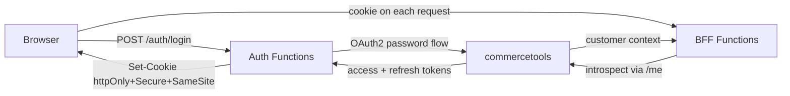

# 0003 — commercetools customer authentication as the identity provider

- **Status:** Accepted
- **Date:** 2026-06-05
- **Tags:** security, identity, architecture

## Context and Problem Statement

The storefront needs sign-up, login, guest checkout, profile, and order history.
We need an identity model. Do we stand up a separate IdP (Azure AD B2C / Auth0 /
custom), or reuse the commerce engine's customer authentication? And how is the
browser session represented and validated?

## Decision Drivers

- **Composability / minimalism** — avoid a second source of truth for customers.
- The cart, profile, and orders are already commercetools customer-scoped
  (`/me`) resources; identity living there avoids a sync problem.
- Strong browser-session security (no tokens in JS-readable storage).
- Clear, documented trade-off on **where** the token is validated.

## Considered Options

1. **Separate IdP** (Azure AD B2C / Auth0) federating to commercetools.
2. **commercetools customer auth, BFF-introspection session** — tokens kept in
   httpOnly cookies; the BFF validates by round-tripping commercetools `/me`.
3. **commercetools customer auth, edge-JWT session** — the Auth service mints a
   short signed session JWT wrapping the customer id (commercetools refresh token
   kept server-side) so APIM can `validate-jwt` at the edge.

## Decision Outcome

**Chosen option: "commercetools customer auth, BFF-introspection session"** as
the default; **option 3 (edge-JWT)** is documented as the alternative.

A dedicated `Mach.Auth.Functions` host wraps commercetools customer auth:
`register`, `login` (OAuth2 **password flow**), `refresh`, `anonymous` (guest
session so guests get a cart), `logout`, `me`. Tokens are handed to the browser
**only** in `httpOnly + Secure + SameSite=Lax` cookies. All customer-scoped work
goes through commercetools `/me` with the caller's token; on sign-in the guest
`anonymousId` cart is **merged** into the customer cart.

**BFF-introspection vs edge-JWT trade-off:** introspection is chosen for
**simplicity and a single source of truth** — no second token format, no key
management, immediate revocation. Its cost is a commercetools round-trip per
validated call (mitigated by short-TTL `ProfileCache` and APIM rate-limiting).
The edge-JWT alternative lets APIM reject unauthenticated calls *before* they
reach a Function (cheaper, edge-enforced) at the price of a custom token, signing
keys, and revocation lag — worthwhile at scale, overkill for this demo.

## Consequences

- **Good:** One identity source of truth; no IdP sync; `/me` is naturally scoped.
- **Good:** Browser never sees raw tokens; CSRF mitigated by `SameSite` + a
  double-submit token on state-changing calls; silent `/auth/refresh` on expiry.
- **Good:** Guest→customer cart merge is built in.
- **Bad / trade-off:** Per-call introspection latency; mitigated by caching and
  the option to switch to edge-JWT later (documented, low-churn change).
- **Neutral:** commercetools API-client secret stays server-side (Key Vault /
  user-secrets); APIM adds rate-limiting and presence checks.

## More Information

- [Architecture plan — Auth microservice](../architecture-plan.md)
- [Checkout sequence](../diagrams/checkout-sequence.md)
