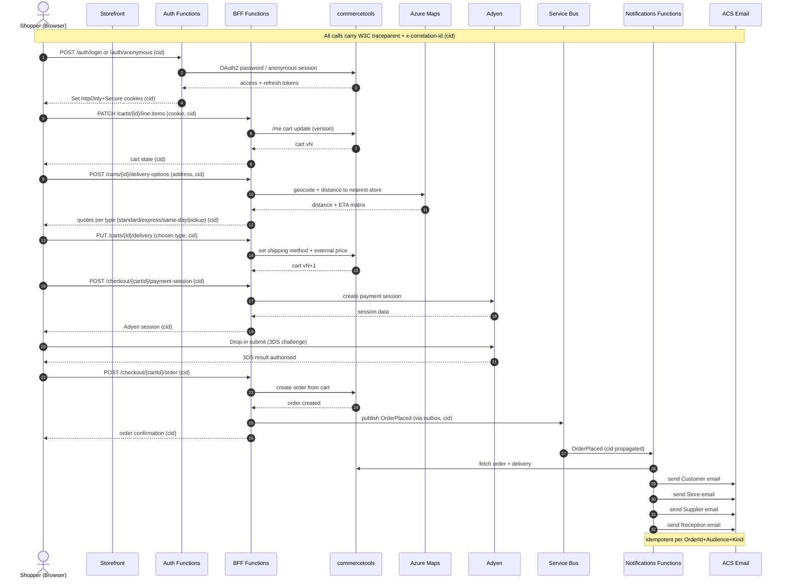

# Checkout Sequence

End-to-end checkout for the MACH demo: anonymous/authenticated session → cart →
distance-based delivery quote → Adyen payment + 3DS → order creation → async
multi-party notification fan-out.

**Correlation:** every hop carries the W3C `traceparent` header plus an
`x-correlation-id` (abbreviated `cid` below). The storefront's typed BFF client
injects them; APIM and the Functions hosts propagate them; the `cid` is attached
to the Service Bus message application properties so the async notification spans
stitch back to the originating request in App Insights.

## Notes

- **Session first.** Guests get an *anonymous* commercetools session (so they
  have a cart); on later sign-in the anonymous cart is **merged** into the
  customer cart. Tokens never reach the browser as JS-readable values — only
  `httpOnly + Secure + SameSite` cookies. See
  [ADR 0003](../adr/0003-commercetools-customer-auth-identity-provider.md).
- **Delivery quoting is synchronous.** The BFF geocodes the address and computes
  distance to the nearest fulfilling store via Azure Maps, returning a price/ETA
  per delivery type; the chosen type is written back to the cart as the shipping
  method + **external price**. See
  [ADR 0006](../adr/0006-distance-based-delivery-external-shipping-price.md).
- **Payment authorisation.** The synchronous flow shown here creates the order
  after a successful 3DS result. The **definitive** payment state still arrives
  asynchronously via the Adyen HMAC webhook → `Webhooks.Functions` → Service Bus
  `payments` topic → `Projection.Functions` (CQRS read-model + order transition);
  that path is omitted here for focus.
- **Reliable publish.** `OrderPlaced` is appended to the transactional
  **outbox** in the same EF transaction as any local write and published by
  `Outbox.Functions` — no dual-write inconsistency.
- **Fan-out is async + idempotent.** `Notifications.Functions` resolves four
  audiences (customer / store / supplier / reception), renders Contentstack copy,
  and records each send in `EmailDeliveries` keyed by `OrderId+Audience+Kind`
  (exactly one per audience). See
  [ADR 0007](../adr/0007-multi-party-notification-fan-out.md).
