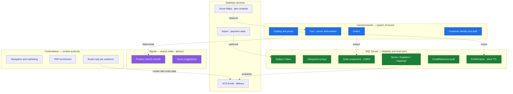

# Context / Data-Ownership Map

Which system **owns** which data. The golden rule: SQL Server is the
*reliability backbone and read store* — it is **never** the source of truth for
catalog, content, identity, or search. Each external system owns its domain;
everything in SQL is either operational plumbing (outbox/inbox/idempotency) or a
**derived/rebuildable** projection.

## Ownership table

| Data | Owner (source of truth) | Notes / derivation |
|---|---|---|
| Catalog, prices, inventory | **commercetools** | Flattened into Algolia and short-TTL-cached in `customers.ProfileCache` (customer) / read paths; never authored in SQL. |
| Cart | **commercetools** (server-authoritative) | Browser holds only a cart id (httpOnly cookie) mirrored in Zustand with the cart `version`. See [ADR 0005](../adr/0005-cart-server-authoritative-zustand-mirror.md). |
| Orders | **commercetools** | Projected into `orders.OrderProjections` for `/orders/me` (CQRS, rebuildable from events). |
| Customer identity & auth | **commercetools** | The identity provider; no separate IdP. See [ADR 0003](../adr/0003-commercetools-customer-auth-identity-provider.md). |
| Navigation, marketing, PDP enrichment | **Contentstack** | Composed with commercetools commerce data at the edge. |
| Email copy (per audience) | **Contentstack** | Subject/body templates with `{{order}}`/`{{delivery}}` tokens; rendered by `Notifications.Functions`. See [ADR 0007](../adr/0007-multi-party-notification-fan-out.md). |
| Search index & suggestions | **Algolia** | Derived from commercetools by `Indexer.Functions`; fully rebuildable. Browser uses a search-only key. See [ADR 0004](../adr/0004-algolia-browser-search-key.md). |
| Geo distance / ETA | **Azure Maps** (stateless) | Computed on demand; result drives the cart's external shipping price. See [ADR 0006](../adr/0006-distance-based-delivery-external-shipping-price.md). |
| Payment state | **Adyen** (stateless to us) | Authoritative via HMAC webhook → `messaging.InboxEvents` (dedup) → projection. |
| Email delivery | **ACS Email** (stateless to us) | Each send audited in `notifications.EmailDeliveries` (`OrderId+Audience+Kind`). |
| Outbox / Inbox / Idempotency | **SQL Server** | Operational reliability plumbing only — the one place SQL *is* authoritative. |
| Stores / Suppliers / SKU→Supplier | **SQL Server** | Operational reference data driving distance quoting + notification recipients. |
